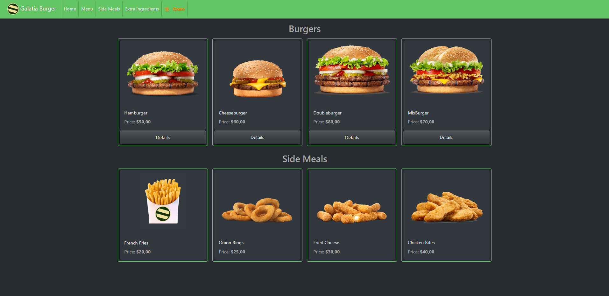

# Galatia Burger (MVC Project)
* A Burger Store Project with CRUD operations
* Project uses N-tier Architecture and Repository Pattern 
* Identity and User Roles will be added.
* Inspired by my hometown and Rome 2 Total War Theme for Galatians.

Main Menu Example

## Resources
* https://bootswatch.com/
* https://getbootstrap.com/
* https://fontawesome.com/
* https://github.com/CodeSeven/toastr
* https://sweetalert2.github.io/#examples
* https://www.tiny.cloud/

### Licence
* No Licence File (Going to be updated)
* Example Picture is just for show and I do not own any images used for media.

